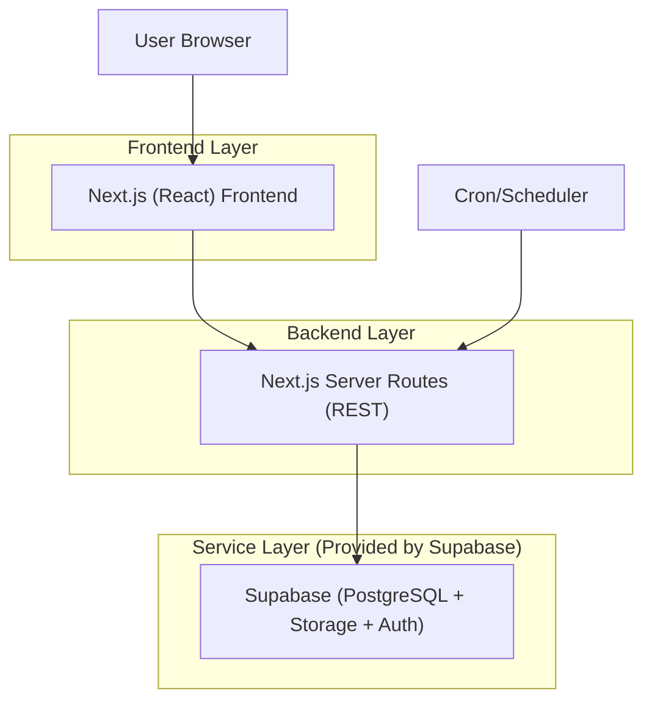
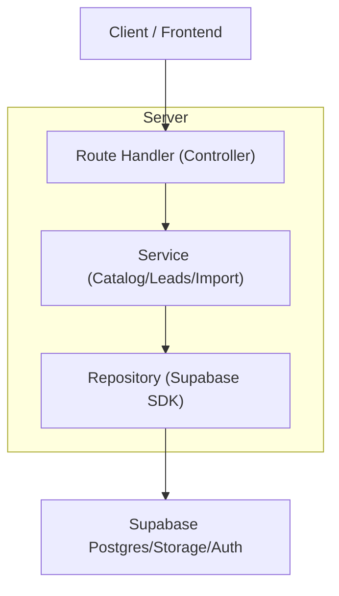
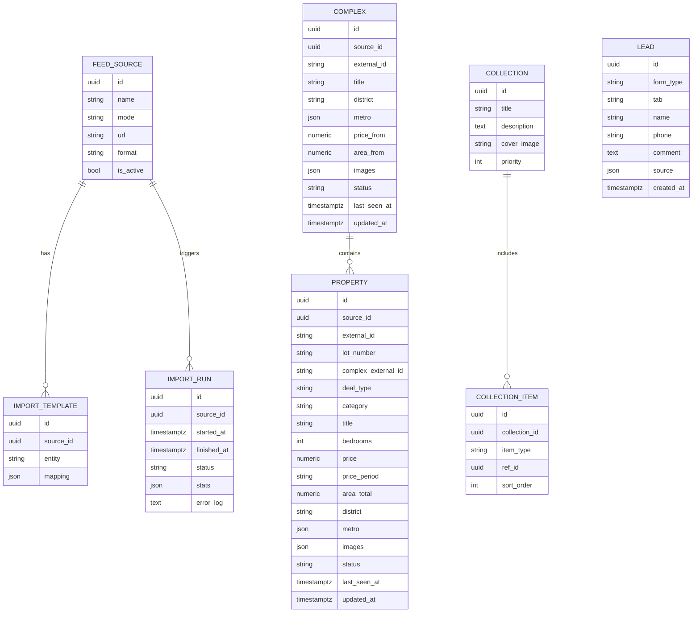

## 1.Architecture design


## 2.Technology Description
- Frontend: React@18 + Next.js@14 (SSR для SEO) + TypeScript
- Backend: Next.js Route Handlers (REST) + Supabase SDK (только на сервере)
- Database: Supabase PostgreSQL
- Storage/CDN: Supabase Storage + Next/Image
- Analytics: Яндекс.Метрика + GA4

## 3.Route definitions
| Route | Purpose |
|-------|---------|
| / | Главная (10 экранов + быстрый вход в каталоги/CTA) |
| /catalog | Каталоги недвижимости с вкладками и фильтрами |
| /property/[slug] | Карточка лота (объект) |
| /complex/[slug] | Карточка жилого комплекса |
| /collection/[slug] | Страница подборки |
| /privacy | Политика конфиденциальности |
| /admin | Админка: витрина/подборки/фиды/импорт/логи/лиды |

## 4.API definitions
### 4.1 Shared TypeScript models
```ts
export type DealType = 'sale' | 'rent'
export type Category = 'newbuild' | 'secondary' | 'rent'
export type RecordStatus = 'active' | 'hidden' | 'archived'

export interface Complex {
  id: string
  source_id: string
  external_id: string
  title: string
  category: 'newbuild'
  district: string
  metro: string[]
  price_from: number
  area_from: number
  images: string[]
  status: RecordStatus
  developer?: string
  class?: string
  finish_type?: string
  handover_date?: string
  geo_lat?: number
  geo_lon?: number
  last_seen_at: string
  updated_at: string
}

export interface Property {
  id: string
  source_id: string
  external_id: string
  lot_number?: string
  complex_external_id?: string
  deal_type: DealType
  category: Category
  title: string
  bedrooms: number
  price: number
  price_period?: 'month'
  area_total: number
  district: string
  metro: string[]
  images: string[]
  status: RecordStatus
  last_seen_at: string
  updated_at: string
}

export interface Collection {
  id: string
  title: string
  description?: string
  cover_image?: string
  items: { type: 'property' | 'complex'; ref_id: string }[]
  priority: number
}

export interface Lead {
  id: string
  form_type: 'consultation' | 'buy_sell' | 'view_details' | 'partner'
  tab?: 'buy' | 'sell'
  name: string
  phone: string
  comment?: string
  source: { page: string; block?: string; object_id?: string }
  created_at: string
}

export interface FeedSource {
  id: string
  name: string
  mode: 'upload' | 'url'
  url?: string
  format: 'xlsx' | 'csv' | 'xml' | 'json'
  is_active: boolean
}

export interface ImportTemplate {
  id: string
  source_id: string
  entity: 'property' | 'complex'
  mapping: Record<string, string>
}

export interface ImportRun {
  id: string
  source_id: string
  started_at: string
  finished_at?: string
  status: 'success' | 'failed' | 'partial'
  stats: { inserted: number; updated: number; hidden: number }
  error_log?: string
}
```

### 4.2 Core REST endpoints
Публичное API
- `GET /api/catalog` — листинг с фильтрами (deal_type/category/bedrooms/price range/district/metro/text)
- `GET /api/property/:slug` — карточка лота
- `GET /api/complex/:slug` — карточка ЖК + лоты
- `GET /api/collection/:slug` — подборка
- `POST /api/leads` — сохранить лид (одна из 4 форм)

Админское API
- `POST /api/admin/feed/upload` — загрузка файла фида
- `POST /api/admin/import/preview` — предпросмотр маппинга
- `POST /api/admin/import/run` — запуск импорта
- `GET /api/admin/import/runs` — список прогонов + логи
- `GET /api/admin/leads` — список лидов

## 5.Server architecture diagram


## 6.Data model
### 6.1 Data model definition


### 6.2 Data Definition Language
```sql
-- FEED SOURCES
CREATE TABLE feed_sources (
  id UUID PRIMARY KEY DEFAULT gen_random_uuid(),
  name TEXT NOT NULL,
  mode TEXT NOT NULL CHECK (mode IN ('upload','url')),
  url TEXT,
  format TEXT NOT NULL CHECK (format IN ('xlsx','csv','xml','json')),
  is_active BOOLEAN NOT NULL DEFAULT TRUE,
  created_at TIMESTAMPTZ NOT NULL DEFAULT now()
);

-- IMPORT TEMPLATES
CREATE TABLE import_templates (
  id UUID PRIMARY KEY DEFAULT gen_random_uuid(),
  source_id UUID NOT NULL,
  entity TEXT NOT NULL CHECK (entity IN ('property','complex')),
  mapping JSONB NOT NULL,
  created_at TIMESTAMPTZ NOT NULL DEFAULT now()
);
CREATE INDEX idx_import_templates_source_id ON import_templates(source_id);

-- IMPORT RUNS
CREATE TABLE import_runs (
  id UUID PRIMARY KEY DEFAULT gen_random_uuid(),
  source_id UUID NOT NULL,
  started_at TIMESTAMPTZ NOT NULL DEFAULT now(),
  finished_at TIMESTAMPTZ,
  status TEXT NOT NULL CHECK (status IN ('success','failed','partial')),
  stats JSONB NOT NULL DEFAULT '{}'::jsonb,
  error_log TEXT
);
CREATE INDEX idx_import_runs_source_id ON import_runs(source_id);

-- COMPLEXES
CREATE TABLE complexes (
  id UUID PRIMARY KEY DEFAULT gen_random_uuid(),
  source_id UUID NOT NULL,
  external_id TEXT NOT NULL,
  title TEXT NOT NULL,
  category TEXT NOT NULL DEFAULT 'newbuild',
  district TEXT NOT NULL,
  metro JSONB NOT NULL DEFAULT '[]'::jsonb,
  price_from NUMERIC,
  area_from NUMERIC,
  images JSONB NOT NULL DEFAULT '[]'::jsonb,
  status TEXT NOT NULL DEFAULT 'active' CHECK (status IN ('active','hidden','archived')),
  developer TEXT,
  class TEXT,
  finish_type TEXT,
  handover_date TEXT,
  geo_lat NUMERIC,
  geo_lon NUMERIC,
  last_seen_at TIMESTAMPTZ,
  updated_at TIMESTAMPTZ NOT NULL DEFAULT now()
);
CREATE UNIQUE INDEX uq_complexes_source_external ON complexes(source_id, external_id);
CREATE INDEX idx_complexes_district ON complexes(district);

-- PROPERTIES / LOTS
CREATE TABLE properties (
  id UUID PRIMARY KEY DEFAULT gen_random_uuid(),
  source_id UUID NOT NULL,
  external_id TEXT NOT NULL,
  lot_number TEXT,
  complex_external_id TEXT,
  deal_type TEXT NOT NULL CHECK (deal_type IN ('sale','rent')),
  category TEXT NOT NULL CHECK (category IN ('newbuild','secondary','rent')),
  title TEXT NOT NULL,
  bedrooms INT NOT NULL,
  price NUMERIC NOT NULL,
  price_period TEXT,
  area_total NUMERIC NOT NULL,
  district TEXT NOT NULL,
  metro JSONB NOT NULL DEFAULT '[]'::jsonb,
  images JSONB NOT NULL DEFAULT '[]'::jsonb,
  status TEXT NOT NULL DEFAULT 'active' CHECK (status IN ('active','hidden','archived')),
  last_seen_at TIMESTAMPTZ,
  updated_at TIMESTAMPTZ NOT NULL DEFAULT now()
);
CREATE UNIQUE INDEX uq_properties_source_external ON properties(source_id, external_id);
CREATE INDEX idx_properties_filters ON properties(deal_type, category, bedrooms, district);

-- COLLECTIONS
CREATE TABLE collections (
  id UUID PRIMARY KEY DEFAULT gen_random_uuid(),
  title TEXT NOT NULL,
  description TEXT,
  cover_image TEXT,
  priority INT NOT NULL DEFAULT 0
);

CREATE TABLE collection_items (
  id UUID PRIMARY KEY DEFAULT gen_random_uuid(),
  collection_id UUID NOT NULL,
  item_type TEXT NOT NULL CHECK (item_type IN ('property','complex')),
  ref_id UUID NOT NULL,
  sort_order INT NOT NULL DEFAULT 0
);
CREATE INDEX idx_collection_items_collection_id ON collection_items(collection_id);

-- LEADS
CREATE TABLE leads (
  id UUID PRIMARY KEY DEFAULT gen_random_uuid(),
  form_type TEXT NOT NULL CHECK (form_type IN ('consultation','buy_sell','view_details','partner')),
  tab TEXT,
  name TEXT NOT NULL,
  phone TEXT NOT NULL,
  comment TEXT,
  source JSONB NOT NULL DEFAULT '{}'::jsonb,
  created_at TIMESTAMPTZ NOT NULL DEFAULT now()
);
CREATE INDEX idx_leads_created_at ON leads(created_at DESC);

-- Minimal grants guideline
GRANT SELECT ON complexes, properties, collections, collection_items TO anon;
GRANT ALL PRIVILEGES ON complexes, properties, collections, collection_items, leads